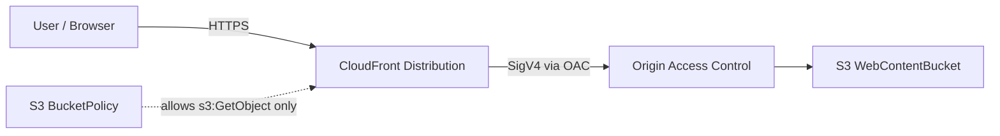

# AWS Architecture Diagram

## Components

- `CloudFrontDistribution`: Delivers web content over HTTPS and redirects HTTP to HTTPS.
- `OriginAccessControl`: Signs requests from CloudFront to S3 with SigV4.
- `WebContentBucket`: Private S3 bucket with encryption, versioning, and public access blocked.
- `BucketPolicy`: Allows read access only from the CloudFront distribution.

## Notes

- `index.html` is used as the default root object.
- `403` and `404` responses are mapped to `/index.html`.
- The template represents a private S3 origin behind CloudFront, not a public S3 website endpoint.
